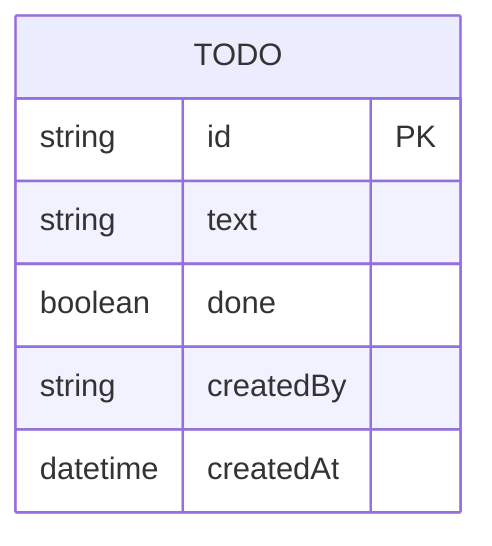

# Domain model

One entity: a Todo on the single shared list, created by whichever signed-in
user added it and toggled or removed by any signed-in user.

`createdBy` records the username of the user who added the item, for display
only — it never restricts who may complete or delete it.