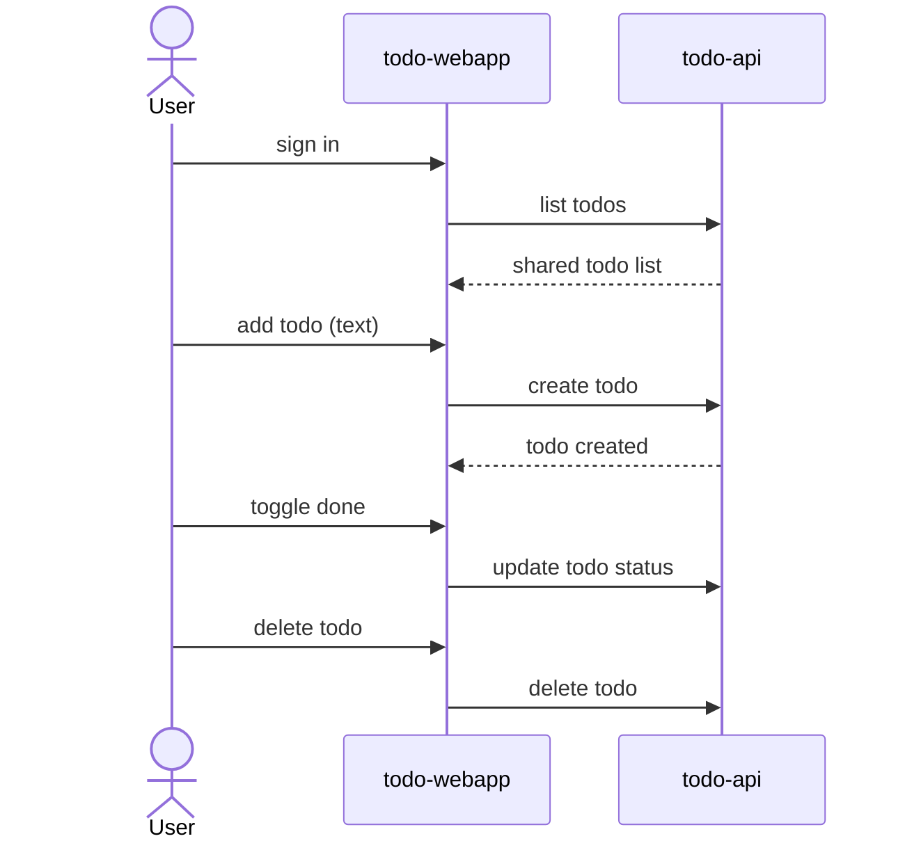

# Manage the shared todo list

A signed-in User adds a task, and any signed-in User can later mark it done
or delete it from the same shared list.

```mermaid
sequenceDiagram
    actor User
    participant todo-webapp
    participant todo-api

    User->>todo-webapp: sign in
    todo-webapp->>todo-api: list todos
    todo-api-->>todo-webapp: shared todo list
    User->>todo-webapp: add todo (text)
    todo-webapp->>todo-api: create todo
    todo-api-->>todo-webapp: todo created
    User->>todo-webapp: toggle done
    todo-webapp->>todo-api: update todo status
    User->>todo-webapp: delete todo
    todo-webapp->>todo-api: delete todo
```

